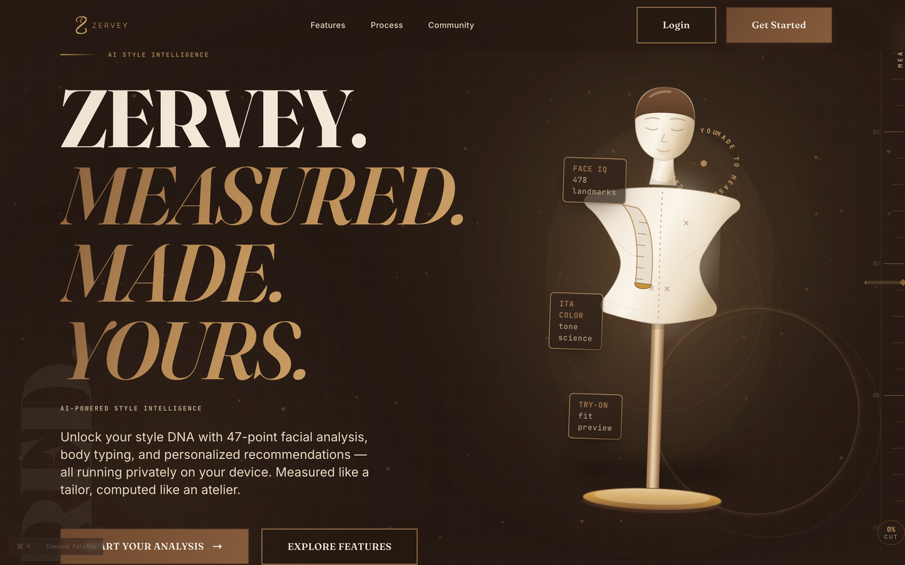

# ZERVEY — AI Style Intelligence

ZERVEY (formerly AuraStyle) is a privacy-first style analysis platform. It performs
47-point facial analysis, 478-landmark face mesh tracking, body typing, color-season
detection, virtual try-on, and outfit recommendations — entirely **on-device** via
MediaPipe. Photos never leave the browser.

## Stack

- **Next.js 14 (App Router)** + React 18 + TypeScript
- **Tailwind CSS** with a cosmic nexus/aurum design system
- **Supabase** — auth and community features
- **MediaPipe Tasks Vision** — on-device face/body/skin analysis
- **Three.js** — parametric 3D style studio (body, hair, garments, glasses)
- **Zustand** — client state · **Framer Motion / GSAP / Lenis** — motion
- **PWA** — offline support via service worker

## Feature catalog

| Area | What it does |
| --- | --- |
| **FaceIQ** | 478-landmark mesh, golden-ratio scoring, face-shape detection (temples/cheekbones/jaw anchors), pose-aware symmetry engine, symmetry split, 3D face view, holographic laser-scan VFX, head-pose + axis readout |
| **Body Analysis** | Body typing (mesomorph/ectomorph/endomorph), shoulder–waist–hip ratios, fit recommendations |
| **Color Analysis** | Skin-tone scale, undertone, seasonal palette (color season detection) |
| **Style DNA** | Trend lines from your saved analysis history |
| **Virtual Try-On** | Face-mapped hair, glasses and glow overlays on your own photo |
| **Hair Preview** | Preview hairstyles against your face |
| **Grooming** | Facial-hair style suggestions |
| **3D Studio** | Fully parametric virtual twin — body sliders, 15 hairstyles, 9 glasses frames, 14 garment items; render or export a preview PNG |
| **Mannequin / Outfit Lab** | Outfit silhouettes and color-stack previews |
| **Recommendations** | Personalized outfit recommendations from analysis results |
| **Community** | Feed, members and tags (sample showcase data) |

## Demo mode isolation

Every analysis page ships with a **demo run** so you can watch a full scan on a sample
photo — no camera or upload needed.

Demo previews are **strictly isolated**:

- Demo results are preview-only and are **never** written to your local history
  (`saveToHistory` hard-blocks demo sources).
- Demo entries can never appear in your **Profile** stats, XP/rank, journey counts,
  score trends, or body trends.
- Demo photos are detected centrally (`isDemoPhoto`) and always render a
  `DEMO SAMPLE` badge.
- The Save action on a demo result is disabled with a "previews only" toast.
- The community feed is static **sample showcase** data — it is not derived from
  your analysis and never mixes with your personal stats.

Demo data exists purely to show how a feature works; it is never treated as a photo
of you.

## Architecture

```
browser ──► MediaPipe (face/body landmarks, segmentation)
              │
              ├─► face-analyzer ──► geometry/scoring ──► FaceIQ result
              ├─► body-analyzer ──► body typing + ratios
              ├─► color-analysis ──► season / undertone
              └─► virtual-tryon / vton-engine ──► overlays on your photo
              └─► three/ studio ──► parametric 3D twin (render in-browser)
```

Key modules:

- `lib/ml/*` — on-device analysis engines (face, body, color, try-on, quality gates)
- `lib/ml/face-geometry.ts` — pose-aware symmetry axis (pupil midpoint → chin tip),
  mirror-based symmetry scoring, structural landmark chains, face-shape classification
- `lib/three/*` — parametric 3D geometry (avatar, garments, hair, glasses, studio)
- `lib/demo/demo-analysis.ts` — shared demo fixtures + demo-media constants
- `lib/history.ts` — local history with demo-entry filtering
- `store/analysis-store.ts` — Zustand analysis state + guarded persistence

Results surfaces use a high-DPI canvas holographic laser scan (`LaserScanOverlay`)
that sweeps the face bounding box; dashboard result panels intentionally skip
scroll-driven blur filters so analysed photos always render crisp.

## Getting started

```bash
# Node 20 is required (see .nvmrc)
nvm install
nvm use

npm install
npm run dev
```

Create `.env.local` from `.env.local.example`:

```
NEXT_PUBLIC_SUPABASE_URL=https://your-project.supabase.co
NEXT_PUBLIC_SUPABASE_ANON_KEY=your-anon-key-here
```

> The app runs without Supabase — auth and community fall back to demo mode.

## Scripts

| Command        | Purpose                          |
| -------------- | -------------------------------- |
| `npm run dev`  | Start the dev server             |
| `npm run lint` | Run ESLint                       |
| `npm run build`| Production build                 |
| `npm start`    | Serve a production build         |

## Screenshots



Live captures of the current dashboard are kept under `docs/screenshots/` (see
`docs/screenshots/README.md`). To refresh them with a headless Chrome:

```bash
npm run dev &
npx --yes playwright@latest install chromium
```

Capture the landing page and any authenticated route, then update the thumbnails
below. Placeholder slots:

- Landing page — `docs/screenshots/landing.png`
- FaceIQ results — `docs/screenshots/faceiq-results.png`
- 3D Studio — `docs/screenshots/3d-studio.png`
- Virtual Try-On — `docs/screenshots/virtual-tryon.png`

## Database

Migrations live in `supabase/migrations/`. Apply in order:

- `001_initial.sql` / `001_community_tables.sql` — core + community schema
- `002_hardening.sql` — RLS, triggers, indexes, rating recalculation

## Authentication

Google OAuth setup (Google Cloud Console + Supabase) is documented in
**[docs/google-oauth.md](./docs/google-oauth.md)**. Login/signup pages show an
in-app fix-it checklist whenever Google returns an access-blocked error.

## Deployment

See **[DEPLOYMENT.md](./DEPLOYMENT.md)** for the full Vercel + Supabase guide,
including Docker self-hosting and security checklists.
